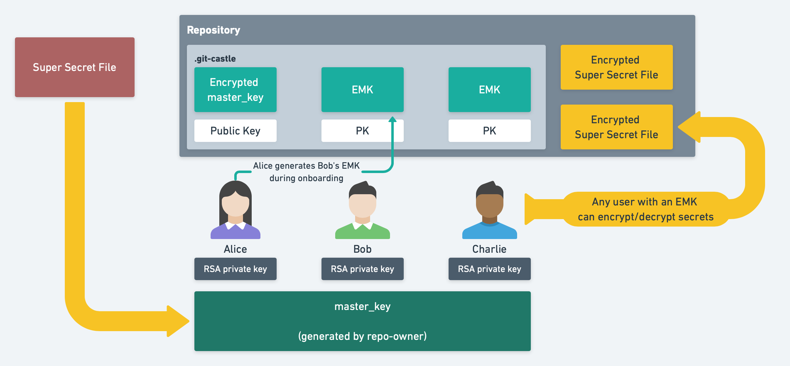

<h1 align="center">Git-Castle 🏰</h1>
<p>
  
  <a href="https://github.com/ajaymerchia/git-castle#readme" target="_blank">
    
  </a>
  <a href="https://github.com/ajaymerchia/git-castle/graphs/commit-activity" target="_blank">
    
  </a>
  <a href="https://github.com/ajaymerchia/git-castle/blob/master/LICENSE" target="_blank">
    
  </a>
</p>

> Store Secrets in Github Securely with `git-castle`!

I was trying to work on a project with some fellow developers working on PCs. Unfortunately, existing tools are limited by platform (few work well on PC), require extremely convoluted setup/installers, or just plain-old don't work.

Introducing `git-castle`! The easiest, lightweight way to manage secrets without the necessity for a full Key Management Solution.

### 🏠 [Homepage](https://github.com/ajaymerchia/git-castle#readme)

## ⚙️ Install 
*One Line Setup! (Thank Goodness)*
```sh
npm install -g git-castle
```

## 📝 Usage
### ⚡️ Quick Setup

```sh
git-castle init
git-castle add-user -u $YOUR_USERNAME
git add .git-castle

git-castle guard $PATHSPEC_TO_SECRET_FILES # Sets the specified file as a secret
git add .git-castle-secrets

git-castle add-hook # Recommended to reduce manual encrypting and decrypting on every commit.

git-castle lockdown # Encrypts the files
git add $PATHSPEC_TO_ENCRYPTED_SECRETS # Adds encrypted files to repositories.
```

When commiting your files, make sure you **DO NOT commit the raw secret files 🔐**. You should add those to your `.gitignore`. 

Files generated by `git-castle` (ending with `.secret`) can be safely checked-in. 💪

### ➕ Add A New User
#### On your Machine
```sh
# Inside the repository you wish to share with the user
git-castle receive-key

# After the New User is successfully added
git add .git-castle
git commit -m "Added $USERNAME to git-castle"
git push
```

Share your `$RECEIVER_ID` with the New User.

#### On the New User's Machine
```sh
git-castle keygen -u $USERNAME -o $OUTFILE.cstl.pub
# if -o is omitted, the public key will be stored in ~/.git-castle/$USERNAME.cstl.pub

git-castle send-key -u $USERNAME -k $OUTFILE.cstl.pub -r $RECEIVER_ID


# After the other user pushes the config update following the send-key operation:
git clone $REMOTE_REPOSITORY # pull if already downloaded
git-castle login -u $USERNAME
git-castle reveal

git-castle add-hook # Recommended for the future
```

## 📖 Commands
### `init`
Initializes `git-castle` in your repository. Run this first.
```sh
git-castle init
git add .git-castle
```

### `add-user`
#### Adding Yourself
Do this first. There are two modes here:
1. **Create New Identity**: if your `$username` does not exist in `$HOME/.git-castle/$username.cstl`, this will create a new identity (RSA keys) in that directory. You can use this username across multiple repositories.
2. **Add Existing Identity to Repo**: if your username does exist locally (in `$HOME/.git-castle`), this script adds your RSA public key to the repository for encrypting the master key.

```sh
git-castle add-user -u $YOUR_USERNAME
```

#### Adding Others
When onboarding collaborators, you need to add their public key to the repository (they can create their key using `git-castle keygen`). 

Once you receive a `{username}.cstl.pub` file from them, you can add them to this repository using the following command.

*To securely share `*.cstl.pub` files, check out `git-castle send-key` below!*

```sh
git-castle add-user -u $THEIR_USERNAME -k $PUBLIC_KEY_FILEPATH

git add .git-castle
git commit -m "Added $USERNAME to git-castle"
git push
```

### `login`
After you've been added to a repository, you need to mark your local identity. You will have to do this after a collaborator adds you in `add-user`.

This will fail if your private key has been moved or deleted. If this happens, repeat `add-user`.
```sh
git pull
git-castle login -u $YOUR_USERNAME
```

### `keygen`
This generates a set of RSA keys to use for sharing and encrypting secrets. 

- The public key will be stored at the `$OUTFILE` (defaults to `$HOME/.git-castle`). 
- The private key will be stored in `$HOME/.git-castle`

```sh
git-castle keygen -u $USERNAME -o $OUTFILE (optional)
```

### `guard`
This adds a pathspec or file to your `.git-castle-secrets` file. Filepaths specified in this file will be encrypted when `git-lockdown` runs.

```sh
git-castle guard $FILES
git-castle guard "$PATHSPEC"
git add .git-castle-secrets

# Examples
git-castle guard data/secrets/file.key
git-castle guard data/secrets/**/*.key
```

### `lockdown`
This encrypts all files specified in `.git-castle-secrets` with the `master_key`. Run this before every commit.

*To automatically run this before every commit, run `git-castle add-hook`*
```sh
git-castle lockdown
```

When adding a new secret, you need to explicitly mark the secret file. After running `lockdown` make sure to commit the secret file to the repository so your collaborators can decrypt them.

```sh
git add $FILES
git add $PATHSPEC
```

### `reveal`
To decrypt files specified in `.git-castle-secrets` (and update your local copies of the keys), run `git-castle reveal`. Run this after every pull.

*To automatically run this after every pull, run `git-castle add-hook`*

```sh
git-castle reveal
```

### 🔐`send-key` / `receive-key`
> `git-castle` provides an easy way to securely share your public keys. 

If you have access to the repository and want to add another user, run the following command.
```sh
git-castle receive-key
>>> Accepting keys! Your Receiver ID is '${receiverID}'. Share this ID with a joiner.
```

Share the `$receiverID` with the user you wish to grant access to.

As the new user, send the RSA key to the existing user using:
```sh
git-castle send-key -u $USERNAME -k $PUBKEY -r $RECEIVER_ID
```

Once the existing user pushes their config change to the repository, run the following to clone and download the secrets.

```sh
git clone $REMOTE_REPOSITORY # pull if already downloaded 
git-castle login -u $USERNAME
git-castle reveal 
```


### Logs
To inspect how `git-castle` is working under the hood and identify its action path, run `git-castle -l $LEVEL $COMMAND` (or `git-castle -vv $COMMAND` to use the `info` log level).

We support the following log levels:
- `trace`
- `debug`
- `info`
- `success`
- `warn`
- `error`
- `fatal`

## How it Works


- The first encryptor generates the `master_key` which will be used to encrypt/decrypt all secrets stored in the repository.
- To add another user, a `git-castle` user with access to the `master_key` creates an `encrypted master_key (EMK)` using a 4096bit RSA key and stores it in the `.git-castle` directory. That user can then access secrets by decrypting the `EMK` using their RSA private key.
- To add a new secret, a `git-castle` user simply encrypts the secret with the `master_key` and uploads the secret to the repository. All secrets are encrypted using `aes-256-cbc`.

## Author

👤 **Ajay Raj Merchia**

* Website: ajaymerchia.com
* Github: [@ajaymerchia](https://github.com/ajaymerchia)

## 🤝 Contributing

Contributions, issues and feature requests are welcome!<br />Feel free to check [issues page](https://github.com/ajaymerchia/git-castle/issues). You can also take a look at the [contributing guide](https://github.com/ajaymerchia/git-castle/blob/master/CONTRIBUTING.md).

## Show your support

Give a ⭐️ if this project helped you!

## 📝 License

Copyright © 2020 [Ajay Raj Merchia](https://github.com/ajaymerchia).<br />
This project is [ISC](https://github.com/ajaymerchia/git-castle/blob/master/LICENSE) licensed.

***
_This README was generated with ❤️ by [readme-md-generator](https://github.com/kefranabg/readme-md-generator)_